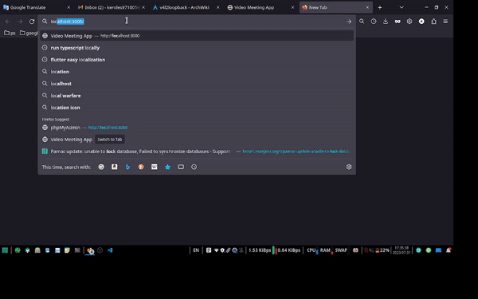

# Simple pure node js video and voice conferencing
> [Live demo](https://ec2-16-16-58-75.eu-north-1.compute.amazonaws.com/)

## Techs:

- Websocket
- WebRTC [native without any plugin]
- Typescript
- webpack
- Docker

## Features:

- Dynamic webrtc multiple connections

## Usage:
> Linux users could use `v4l2loopback` to create multiple virtual devices to test multiple connections.<br/>
> For archlinux [v4l2loopback](https://wiki.archlinux.org/title/V4l2loopback)

### With docker

1- build image
```console
docker build -t $(image_name) .
```
2- run container
```console
docker run --name $(container_name) -d -p 3000:3000 $(image_name)
```

### Without docker

1- install dependencies
```console
npm i
```
2- compile tsc
```console
npm run tsc
```
3- webpack build
```console
npm run build
```
4- run server
```console
npm run up
```



